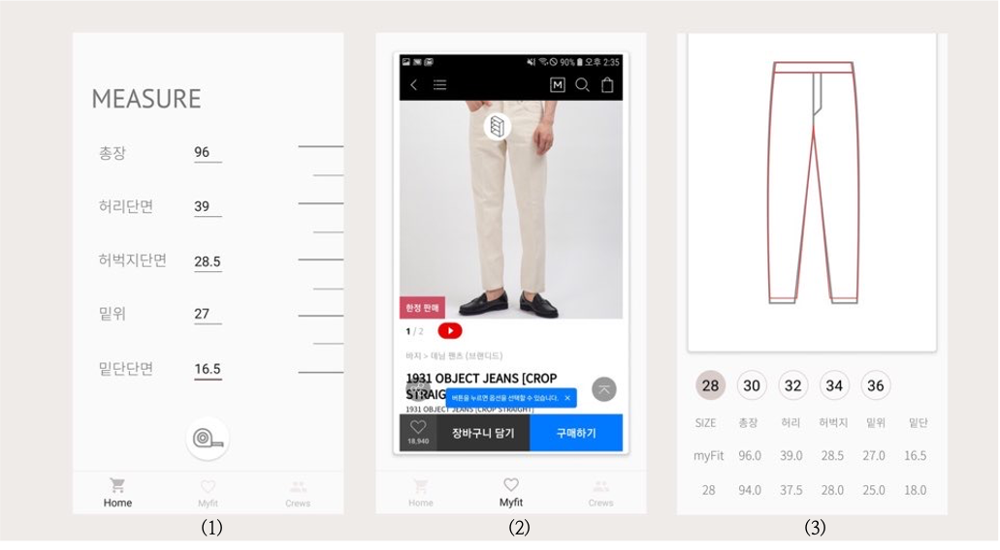

# MY FIT

**MY FIT is an Android application developed in 2019** that enhances the online clothing shopping experience by enabling users to visually compare clothing sizes using OCR and intuitive 2D modeling: (1) Input measurements for owned items, (2) Save and compare the sizes of items you plan to buy, and (3) Compare multiple sizes visually at the same time

## Features
When shopping for clothing online via mobile, users can capture a size chart, which is then read using OCR and modeled into a 2D visual format to compare sizes. The service is provided with the help of tooltip guidance.
Users can input the actual measurements of clothing they own and save information and sizes of items they wish to purchase. This allows consumers to visually compare the sizes of products they want to buy with those they already own or have purchased. 
Additionally, multiple sizes can be compared simultaneously, making it easy for users to find the size that best fits them.
